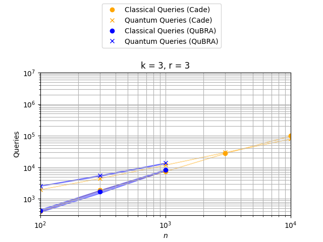

# Development Documentation

To contribute towards development, create a new virtual environment (using [venv](https://docs.python.org/3/library/venv.html), a tool such as [pew](https://pypi.org/project/pew/), or your favorite IDE), check out this repository, and install it using [development ("editable") mode](https://setuptools.pypa.io/en/latest/userguide/development_mode.html), as follows, to include the optional development dependencies:

```shell
# in a virtual environment
pip install -e '.[dev]'
```

## Repository Structure

```
.
├── .github         # github configuration
├── data            # reference data and default log output directory
├── docs            # documentation
├── examples        # examples that showcase qubrabench library
├── qubrabench      # qubrabench package (quantum subroutines with benchmarking support)
├── tests           # unit tests
├── conftest.py     # pytest configuration
├── DEVELOP.md
├── LICENSE
├── Makefile
├── pyproject.toml
└── README.md
```

Examples contain different problem sets (SAT, community detection, ...), which may have multiple programmatic solvers, shared data structures, user interfaces and outputs.
Tests for the example solvers should be placed in a new Python file next to the solver, instead of inside the project's `tests` directory.

`qubrabench` contains the benchmarking related code.
This includes statistics classes as well as _quantumizable_ algorithms that execute classically, while estimating quantum cost (or bounds) theoretically during runtime.

## Contributing

To contribute to the repository, [fork](https://docs.github.com/en/get-started/quickstart/fork-a-repo) it and create a new branch for your changes in the fork.
Make sure to format, lint and test your code.
More details on the individual actions are below, but you can quickly evaluate the project the same way our GitHub actions are performed by simply running `make` in the root of this repository.

After you finished testing your implementation, create a [pull request](https://docs.github.com/en/pull-requests/collaborating-with-pull-requests/proposing-changes-to-your-work-with-pull-requests/about-pull-requests) to start the integration of your changes into this repository.
GitHub provides a [Quickstart Article](https://docs.github.com/en/get-started/quickstart/contributing-to-projects) on how to contribute to projects, including step-by-step guides for everything mentioned above.


## Testing

This library uses the [pytest](https://docs.pytest.org/) library, which makes testing very simple.
You can use the predefined [tests](tests), or write your own tests.
To execute all tests in the project, by simply executing the following command in the project root:

```shell
pytest --doctest-modules
```

Pytest will search for all files starting with `test`, and will test all methods containing the word `test`.
The option `--doctest-modules` [runs tests inside docstrings](https://docs.pytest.org/en/7.1.x/how-to/doctest.html).

One useful feature of pytest is to use markers. You can mark a method with a test marker, as seen in this example:

```python
@pytest.mark.slow
def test_that_runs_for_a_long_time():
    pass
```

You can then single out certain tests to run by a certain marker with the `-m` parameter, for example `pytest -m slow` to run only tests marked as `slow`, or `pytest -m "not slow"` to run all but those tests.
See `pytest --markers` for a list of all available markers.

### Run Existing Benchmarks

To benchmark the example hillclimber algorithm for MAX-k-SAT with multiple input sizes, you can run the [bench_hillclimber.py](examples/sat/bench_hillclimber.py) script.
Run `./examples/sat/bench_hillclimber.py -h` to obtain an overview over the available commands of this example.

To aggregate benchmarking data, run you can run the following example to produce 5 runs of `k=3` SAT problems. In this example, `k` is the number of literals in a clause, `n` is the total number of variables and `r` is a factor for determining the number of clauses `m = r * n`. A path to the desired output can be provided after the `--save` flag.

```shell
./examples/sat/bench_hillclimber.py hill-climb -k 3 -r 3 -n 100 --runs 5 --save sat.json
```

In this case, the generated data is stored in the `sat.json` file.

As one will often want to benchmark algorithms for multiple choices of problem sizes and other parameters, using a shell script to execute multiple benchmarks in a batch can be useful.
See [Makefile](Makefile) for an example.

### View Benchmark Results

To generate a plot, you first need to run benchmarks and thereby populate a JSON output file, like the `sat.json` file in the example above.
Once this is done, you can generate a plot based on this file by running the script `./examples/sat/bench_hillclimber.py plot <path-to-file>`.

You can also use the targets of the [Makefile](Makefile) to run predefined benchmarking sets and view the plots.
The following plot is produced by the command:
```shell
make bench-hillclimber-quick
```




## Logging

You can chose two options when running the qubrabench script:

- `--verbose` (default): The script outputs information on `DEBUG` level and saves all log output in a log file.
- `--no-verbose`: The script outputs all information on `INFO` but does not save the output to a log file.

Annotation - logging levels: `ALL < TRACE < DEBUG < INFO < WARN < ERROR < FATAL < OFF`.

Please keep this functionality in mind when writing new code for QuBRA Bench, use `logging.info()` for relevant information outside of debug mode and use `logging.debug()` for messages with debug interest.
Refrain from using the default `print` function.

## Randomness

Some algorithms and examples operate on randomly generated instances.
To avoid global random number generated state and the problems that arise with it, we often pass random number generator (RNG) instances as function parameters.
RNG function parameters should never have default values.

For testing purposes, there is a [fixture](conftest.py) in place that optionally provides an RNG instance to test methods that have an `rng` parameter.

## Code Style

Please provide docstrings in the [Google Python Style](https://google.github.io/styleguide/pyguide.html) for every module, class and method that you write. 
Public facing API functions should also contain `mypy` type hints.
When type hints are present in the method declaration, they may be omitted from the docstring.
For an extensive example see [here](https://sphinxcontrib-napoleon.readthedocs.io/en/latest/example_google.html).

For formatting, make use of the [black](https://black.readthedocs.io/en/stable/) autoformatter with default configuration.

Linting will be checked by GitHub actions.
This projects uses the [ruff](https://beta.ruff.rs/docs/) linter. 
